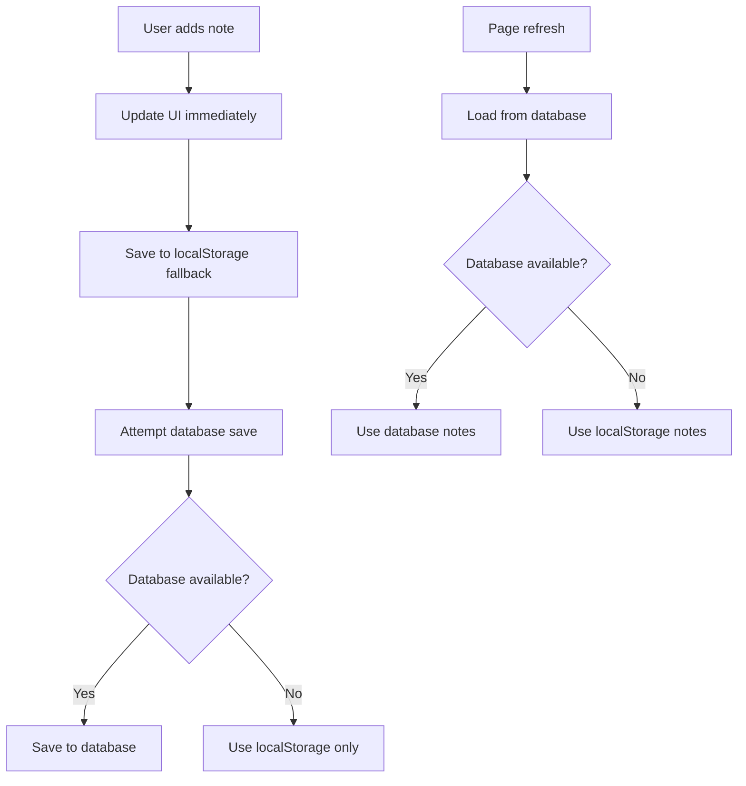

# Pick Notes Database Setup

## Database Table Structure

The pick notes are stored in a dedicated `pick_notes` table with the following structure:

```sql
CREATE TABLE IF NOT EXISTS pick_notes (
    id SERIAL PRIMARY KEY,
    pick_key VARCHAR(50) NOT NULL UNIQUE,
    note TEXT NOT NULL,
    created_at TIMESTAMP DEFAULT NOW(),
    updated_at TIMESTAMP DEFAULT NOW()
);
```

### Table Fields:
- **id**: Auto-incrementing primary key
- **pick_key**: Unique identifier for each pick (format: "round-teamId", e.g., "1-team1")
- **note**: The note text content
- **created_at**: When the note was first created
- **updated_at**: When the note was last modified

## API Endpoints

### 1. GET /api/notes
Load all pick notes from the database.

**Response:**
```json
{
  "notes": {
    "1-team1": "Great value pick here",
    "3-team2": "Reached for this player",
    "5-team1": "Solid mid-round choice"
  }
}
```

### 2. POST /api/notes
Save or update a pick note.

**Request Body:**
```json
{
  "pickKey": "1-team1",
  "note": "This is a great pick"
}
```

**Response:**
```json
{
  "success": true,
  "message": "Note saved successfully",
  "pickKey": "1-team1",
  "note": "This is a great pick"
}
```

### 3. DELETE /api/notes/{pickKey}
Delete a specific pick note.

**Example:** `DELETE /api/notes/1-team1`

**Response:**
```json
{
  "success": true,
  "message": "Note deleted successfully",
  "pickKey": "1-team1",
  "deleted": true
}
```

## Setup Instructions

### 1. Initialize Database
First, create the database table by calling the init endpoint:
```
GET /api/init-db
```

This will create both the existing `draft_state` table and the new `pick_notes` table.

### 2. Test Database Connection
Verify everything is working:
```
GET /api/db-test
```

### 3. Test Pick Notes API
You can test the endpoints directly:

**Save a note:**
```bash
curl -X POST /api/notes \
  -H "Content-Type: application/json" \
  -d '{"pickKey": "1-team1", "note": "Test note"}'
```

**Load all notes:**
```bash
curl /api/notes
```

**Delete a note:**
```bash
curl -X DELETE /api/notes/1-team1
```

## Frontend Integration

The frontend automatically:
1. **Loads notes on startup** via `loadNotesFromDatabase()`
2. **Saves notes immediately** when added via `saveNoteToDatabase()`
3. **Deletes notes immediately** when removed via `deleteNoteFromDatabase()`
4. **Falls back to localStorage** if database is unavailable

## Database Configuration

Make sure your Netlify environment has one of these variables set:
- `NETLIFY_DATABASE_URL` 
- `DATABASE_URL`

The database URL should be your Neon PostgreSQL connection string.

## Migration from localStorage

If you have existing notes in localStorage, they will automatically be used as fallback until the database endpoints are available. Once the database is set up, you may want to migrate existing localStorage notes to the database.

## Troubleshooting

1. **Check database connection**: Visit `/api/db-test`
2. **Initialize tables**: Visit `/api/init-db`  
3. **Check console logs**: Look for database connection errors in Netlify function logs
4. **Verify environment variables**: Ensure `DATABASE_URL` is set correctly

## Notes Persistence Flow

